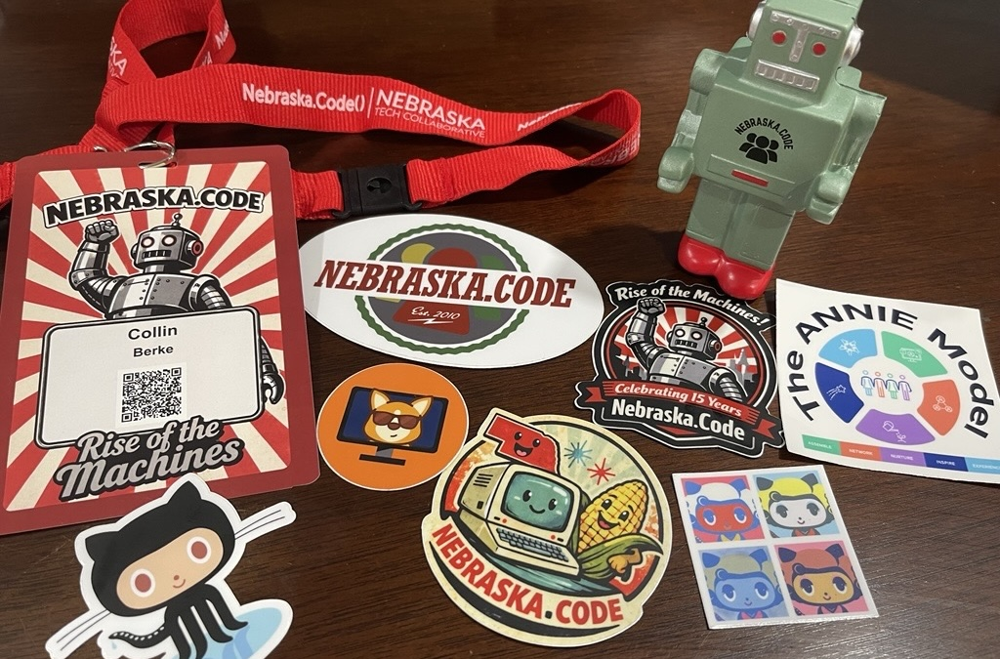

I attended [Nebraska.Code() 2026](https://www.nebraska-code.com/), an annual conference bringing together developers, engineers, and tech professionals across the Midwest.
This was my fourth year attending.
I find this conference a good opportunity to stay connected with what's happening in tech.
It being local conference--held here in Lincoln, NE--is also a big draw for me.
This post highlights my takeaways from this year's conference.

{fig-align="center"}

# Wednesday's workshop

On Wednesday, I attended the full-day workshop Diverge, Then Converge.
The training was organized by [Don't Panic Lab's](https://dontpaniclabs.com/) [Brian Zimmer](https://www.linkedin.com/in/bmzimmer/) and [Anne Ruskamp](https://www.linkedin.com/in/anne-ruskamp/).
It was a full-day training packed with useful information--too much to unpack all of it here in this recap.
Here's a list of my key takeaways, many of which are various tools discussed during the session:

* [Do a Mashup](https://www.ideou.com/pages/ideation-method-mash-up?srsltid=AfmBOoot7McAk0AHtTC9S_GkdmpHRyaRXtA7mfaYwlHTST3ehEs8dMus), phrase the challenge using "How might we ..." questions.
* Write a news article about your product: What if it's a wild success? What if it's a massive failure?
* Generate key questions
* Use the scientific method to run small experiments
* [Powell's 40-70 Rule](https://medium.com/@isaiahctaylor/the-40-70-rule-the-secret-to-overcoming-perfectionism-19de1a2ceb84)
* Problem-solution fit vs. product market fit
* Avoid the trap of the 'Obvious Solution' or 'Silence'
* Three ways to make a decision: command, consult, consensus. Add pressure release valves and time box decisions. Be transparent.
* [RICE Scoring](https://www.intercom.com/blog/rice-simple-prioritization-for-product-managers/)

Here are some quotes I took away from the training and discussions:

* "Have you fallen in love with your **problem** or your **solution**?"
* "Invention is creating something new, but is yet to be adopted.
An innovation has proven market viability.""
* You pay for it once, or you pay for it twice.
* "Constraints are your friend."

I had seen a version of this presentation during a breakout session last year.
The opportunity to go deeper was the value add for participating in the full day of training.
Being able to hear from other workshop members about how they applied these tools and some tips to make them even more effective was also beneficial.

# Thursday and Friday's keynote and breakout sessions

## Keynotes

### Beyond the AI Hype: What's Real, What's Next

[Richard Campbell's](https://bsky.app/profile/richcampbell.bsky.social) keynote was a good start to the day.
The main point was clear: we choose how AI is used.
It also was informative to hear the history of AI development, while also getting insight into where this part of the industry is going.
Is this the ['dot-com bubble'](https://en.wikipedia.org/wiki/Dot-com_bubble) all over again?
Maybe, but it sure is another disrupter.
The talk also had a good reminder: we are here to solve people's problems, not to just write code or use tech for the sake of using tech.

### Stop Chasing Growth and Start Leading It

[Christine DiDonato's](https://www.linkedin.com/in/christinedidonato/) message was a beneficial moment of reflection: stop chasing growth and start leading it.
Clarity was a key theme of the talk, and I thought this quote summarized this well:

> Hustle will move you fast. Clarity will move you forward.

As part of the talk, five principles of clarity were shared:

1. You can't change what you won't own.
2. You can't see a feature through an old lens.
3. Growth will feel like pain when it's not aligned to what you value.
4. If you don't choose your destination, someone else will choose it for you.
5. You don't have to feel brave to be brave.

I'm still unpacking everything I learned from this talk.
I was glad to have the opportunity to hear it during at the conference.

Both of these keynotes were exceptional.
Each had a great message.
I also really enjoyed some of the practical tools provided.
It's always great when you get a moment to pause and reflect.

## Breakout Sessions

I also attended several breakout sessions, which covered a range of topics.
Some were technical, code, and AI focused.
Others focused on team building, organizational culture, and career development.

### Technical, code, and AI sessions

In terms of the technical, code, and AI focused sessions, I attended the following talks:

* Mission-Critical Code: What NASA's Power of Ten Can Teach Us ([Jonahtan 'J.' Tower](https://www.linkedin.com/in/jtower/); slides are [here](https://github.com/trailheadtechnology/power-of-ten))
* Tackling Technical Debt with the Mikado Method ([Joshua Holland](https://www.linkedin.com/in/joshua-holland-can-help/))
* Data Strategy Maturity Levels ([Whitney Lovelace](https://www.linkedin.com/in/whitney-lovelace-92aa6287/) & [Grey Lovelace](https://www.linkedin.com/in/grey-lovelace-baa73948/))
* A Developer's Guide to Database Patterns ([Jerry Nixon](https://www.linkedin.com/in/jerrynixon/))

#### Takeaways from the technical sessions

I was introduced to NASA's Power of Ten rules in Jonahtan Tower's talk.
These rules are a framework for creating more reliable code.
First and foremost, it's important to understand critical code.
That is, code that could harm human life, safety, money, trust, and societal systems.
Indeed, many of us are not writing code directly impacting human life or safety.
However, many of us are writing code that impacts money and trust.
As such, we're all writing 'critical code'.
The Power of Ten rules can be found [here](https://en.wikipedia.org/wiki/The_Power_of_10:_Rules_for_Developing_Safety-Critical_Code).
The example code in this talk emphasized how to apply these rules in code.
I'll be going back to these.

Joshua Holland's talk introduced the [Mikado Method](https://mikadomethod.info/).
Mikado includes the following steps: set a goal; run a quick experiment; visualize the work; and undo changes that aren't progress.
The Mikado tree diagrams looked useful for getting a handle on the work needed to tackle technical debt.
This presentation was packed with some good phrases to apply this method:

* "Checked off a node, check in your code."
* "Simple, cheap experiments. You can always roll it back."
* "Two is a to-do, three needs a tree."

It was useful to hear Whitney and Grey Lovelace define the different data maturity levels.
It was refreshing to hear these levels are an organizational choice based on resources available.
It's not necessarily a ladder you need to climb.
I also appreciated Grey's openness to answer one of my questions about using Google Cloud Storage hash values to optimize file processing.
His answer was really helpful.

I took a lot of notes during Jerry Nixon's database patterns session.
The message was clear: offloading processes to a database is likely better.
I really liked how the whole talk started with the simple `CREATE TABLE` statement, and it built upon the statement by showing the application of several column level properties.
There were also multiple points made about how to optimize specific patterns if you apply some database principles and functionality in your design.
These included points about stored procedures vs ad hoc SQL; code first vs. database first; direct access vs. API; and HA vs. Named Replicas.
There was also a push to check out [DiskANN (Vector Nearest Neighbor)](https://github.com/microsoft/DiskANN), which was stated to be a new, really powerful tool.

### Team building, organizational culture, and career development sessions

For the topics of team building, organizational culture, and career development, I attend:

* Facing the Future: Three ways to Proactively Manage Change ([Sarah F. Wimberley](https://www.linkedin.com/in/sarahfwimberley/))
* Skills to Bills: A Users Guide to Demonstrated Competency ([Nerando Johnson](https://www.linkedin.com/in/nerando-johnson/))
* Practical tips to break work down and deliver twice as fast ([Dea Mandrey](https://www.linkedin.com/in/dea-mandery/))
* Culture as Code: Refactor Your Team's Operating System for Resilience, Curiosity, and Flow ([Teresa Rush](https://www.linkedin.com/in/teresa-hillrush/))
* Not Another AI Talk ([Brian Zimmer](https://www.linkedin.com/in/bmzimmer/))

#### Takeaways from the team building, organizational culture, and career development sessions

These sessions were really useful because many shared various frameworks.
When it came to the topic of managing change in Sarah F. Wimberley's talk, there was a reminder that every little change will affect somebody, somewhere.
So, to manage the impact caused by this change, it's best to explore in terms of three components: people, process, and technology.
When it comes to people, manage expectations, acknowledge fear, and consider the end user.
In terms of process, fix the process not the people performing the process; document, share, and learn; take in feedback.
For technology, remember that good tools make processes work; get a box around the problem; consider dependencies and negative impacts downstream.

While learning about how to break problems into smaller bits from Dea Mandrey, I was introduced to the following framework:

* Understand the problem
* Become outcome obsessed
* Prototype
* Use feedback loops to refine
* Stop when you hit the outcome

I was reminded of these useful questions while reviewing this framework:

* What's the problem we're solving?
* How do we know we're solving it?

I also learned about smash events and the [Pareto Principle](https://en.wikipedia.org/wiki/Pareto_principle).

The ANNIE model developed by Teresa Rush seemed useful:

* Assemble (connection)
  - Can we come together?
* Network
  - Can we collaborate and understand each other?
* Nurture
  - Do teams have what they need to grow?
  - Do you have the things to grow and personally grow to be your best self?
* Inspire
  - Do you know the bigger picture, does the team know it?
* Experience
  - What experiences are your team sharing?
  - Are you celebrating milestones?

This session was also a good reminder to periodically do a culture check with your team from time to time.
The ANNIE model is a great framework for this.
If something is low or missing, refactor it.
Side note, [Kahoot](https://kahoot.com/) seemed like an interesting engagement tool.

During Brian Zimmer's session, I was introduced to some statistics around [low engagement taking place in the US workforce](https://www.gallup.com/workplace/229424/employee-engagement.aspx).
AI, depending on how it is introduced and integrated into the workforce, has the opportunity to improve this lack in engagement.

> Where there is change and uncertainty, there is opportunity for those who are bold.

A key point made was Silicon Valley provides the capability, but adoption is determined by the users.
However, the difference emerges out of our decisions or indecisions.
An interesting question was posed:

> What would this role look like if AI erased the worst hour of that person's day?

The points about there being no playbook for this, so experimentation needs to lead was a useful framing.
Some additional points were made that were worth further reflection.

Lastly, Nerando Johnson's talk had some really good points on how to demonstrate your competency and expertise.
I was already thinking about doing a recap post for this event.
This talk motivated me to actually get this done.

# A thank you

Having this type of conference in the Midwest is really valuable.
Being able to see all the cool things people are doing while also learning about cool, useful ideas is what makes going to conferences like this so beneficial.
I am so grateful to the organizers who put this together each year and make events like this happen!
